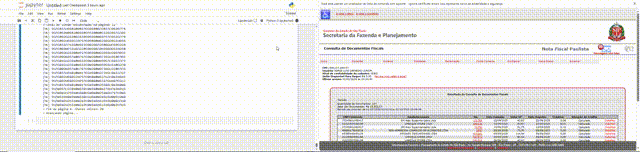

# **Automação e Análise de Notas Fiscais (NFP)**

## **📊 Acesso ao Dashboard**

[**Clique aqui para ver o Dashboard Interativo**](https://jorgeluisunesp-gif.github.io/nfp-audit-automation/)

*O dashboard carrega automaticamente dados fictícios de exemplo para demonstração.*

Este projeto é uma ferramenta completa de **ETL (Extract, Transform, Load)** e **Web Scraping** desenvolvida em Python para automatizar a extração, consolidação e análise de dados fiscais do portal da Nota Fiscal Paulista.

## **🎯 Objetivo**

Automatizar a auditoria de gastos pessoais e fiscais, contornando desafios técnicos como captchas, sessões dinâmicas e dados não estruturados, consolidando informações de múltiplas fontes (Web Scraping \+ Arquivos CSV \+ Chaves de Acesso) em um Dashboard interativo.

## **🛠️ Tecnologias Utilizadas**

* **Python 3.x**: Linguagem principal para scripts de automação e tratamento de dados.  
* **Selenium WebDriver**: Framework de automação de navegador para scraping dinâmico e interação com o portal.  
* **Requests & BeautifulSoup**: Bibliotecas para requisições HTTP otimizadas e parsing de HTML.  
* **Pandas/CSV**: Manipulação, limpeza e estruturação de dados.  
* **HTML5/JS/Chart.js**: Criação do dashboard analítico para visualização interativa dos dados.  
* **Técnicas de Bypass**: Implementação de estratégias como uso de portas de depuração (Debugging Port) para contornar mecanismos de detecção de bots.

## **🚀 Funcionalidades**

1. **Crawler de Chaves de Acesso**:  
   * Navega de forma autônoma pelo portal da NFP, contornando proteções anti-robô.  
   * Extrai chaves de acesso (44 dígitos) ocultas em eventos JavaScript (onclick com Base64).  
   * Gerencia paginação e manutenção de sessões de forma resiliente.  
2. **Sanitização de Dados (Data Cleaning)**:  
   * Conversão e tratamento de arquivos CSV legados (UTF-16 LE com BOM) para formato JSON estruturado.  
   * Normalização de CNPJs, datas e valores monetários para garantir consistência.  
3. **Enriquecimento de Dados**:  
   * Decodificação semântica da Chave de Acesso (UF, Modelo, Série, Dígito Verificador).  
   * Cruzamento de dados (Merge) entre as chaves extraídas e os resumos financeiros exportados.  
   * Correção automática para diferenças de layout entre modelos de nota (NF-e 55 vs. SAT 59).  
4. **Dashboard Analytics**:  
   * Interface web local para visualização de KPIs (Total Gasto, Top Fornecedores).  
   * Gráficos interativos de evolução temporal e distribuição de gastos.

## **⚠️ Nota sobre Privacidade e Dados**

Este repositório contém apenas o código-fonte e dados fictícios para demonstração. **Nenhum dado fiscal real, chaves de acesso, certificados digitais ou informações pessoais foram incluídos.** Os arquivos JSON/CSV de exemplo são meramente ilustrativos (mock\_data.json).

## **🔧 Como Usar**

### **Pré-requisitos**

* Python 3.8+  
* Google Chrome ou Microsoft Edge  
* Drivers do Selenium configurados e no PATH

### **Instalação**

Clone o repositório e instale as dependências:

git clone \[https://github.com/seu-usuario/projeto-nfp-automacao.git\](https://github.com/seu-usuario/projeto-nfp-automacao.git)  
cd projeto-nfp-automacao  
pip install \-r requirements.txt

### **Execução dos Scripts**

1. **Extração de Chaves (web-scrap-nfp.py):**  
   * Inicia o navegador em modo de depuração para permitir login manual e resolução de captchas.  
   * Navega pelas páginas de notas e extrai as chaves de acesso para um arquivo de texto.  
   * *Nota: Configure o caminho do seu perfil de navegador no script, se necessário.*  
2. **Limpeza de CSV (limpa\_csv\_nfp.py):**  
   * Processa o arquivo CSV bruto exportado do portal (com encoding complexo) e gera um JSON limpo (notas\_portal\_limpo.json).  
3. **Consolidação (consolidar\_chaves\_json.py):**  
   * Cruza as chaves extraídas com os dados do CSV limpo.  
   * Gera o banco de dados final notas\_fiscais\_completo\_final.json, enriquecendo as chaves com valores e nomes de emitentes.  
4. **Visualização (index.html):**  
   * Abra o arquivo index.html em qualquer navegador moderno.  
   * Clique em "Carregar JSON" e selecione o arquivo gerado (ou use o mock\_data.json para testar).

## **⚖️ Licença**

Este projeto é distribuído sob a licença MIT. Sinta-se livre para usar, estudar e modificar.